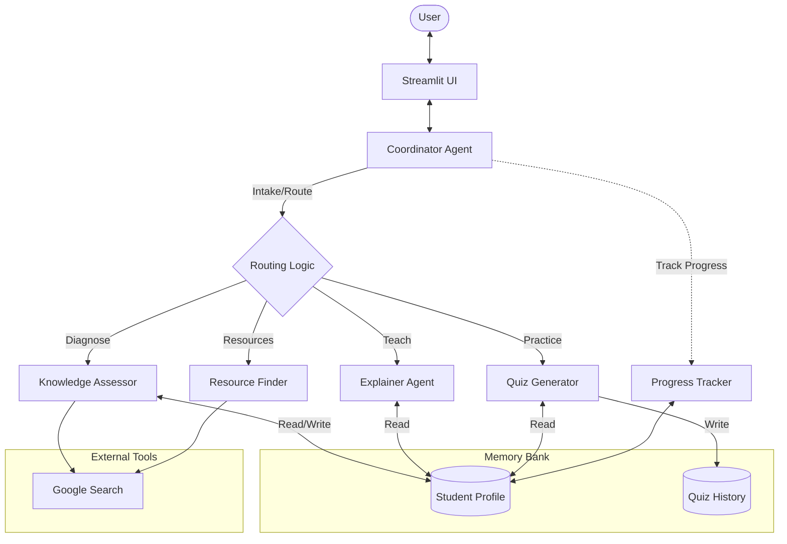

# Study Buddy AI Architecture

```mermaid
graph TD
    User([User]) <--> UI[Streamlit UI]
    UI <--> Coordinator[Coordinator Agent]
    
    subgraph "Memory Bank"
        Profile[(Student Profile)]
        History[(Quiz History)]
    end

    Coordinator -->|Intake/Route| Router{Routing Logic}
    
    Router -->|Diagnose| Assessor[Knowledge Assessor]
    Router -->|Teach| Explainer[Explainer Agent]
    Router -->|Practice| QuizGen[Quiz Generator]
    Router -->|Resources| ResFinder[Resource Finder]

    Assessor <-->|Read/Write| Profile
    Explainer <-->|Read| Profile
    QuizGen <-->|Read| Profile
    QuizGen -->|Write| History
    
    subgraph "External Tools"
        GoogleSearch[Google Search]
    end
    
    Assessor --> GoogleSearch
    ResFinder --> GoogleSearch
    
    Coordinator -.->|Track Progress| ProgressTool[Progress Tracker]
    ProgressTool <--> Profile
```
